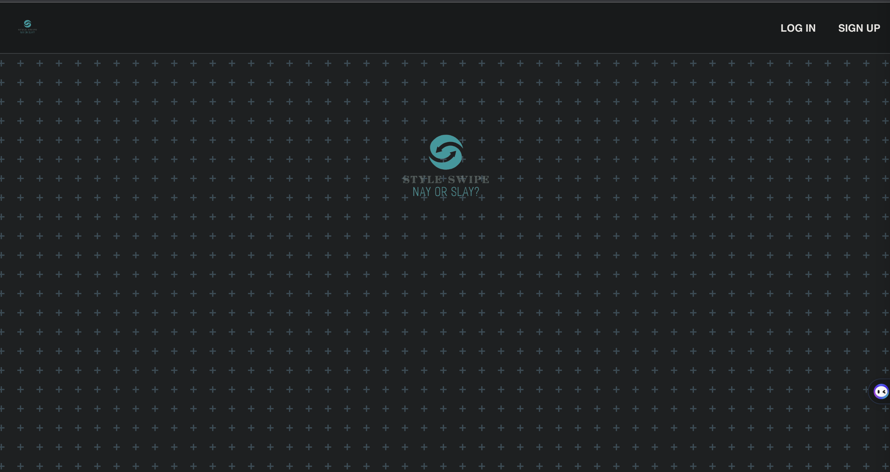

<div style="text-align: center;">
  <a href="https://style-swipe.netlify.app" style="font-size: 30px;">StyleSwipe</a>
</div>
<br>

<div align="center">
 </a>
</div>

# Check out a user-based collection of the trendiest clothes on StyleSwipe


## 🧐 About

<p>
  StyleSwipe is a MERN stack app using JWT Authentication. Upload, browse, and comment on outfits posted from other users across the web.
</p>

## 🏁 Getting Started

1. Access our deployed front-end application [here](https://style-swipe.netlify.app).
2. Access our Trello planning materials [here](https://trello.com/b/PI1Ocv36/styleswipe).
3. Access our backend Github repository [here](https://github.com/korycfitz/StyleSwipe-back-end).
<br><br>
## Highlight
<p>
  StyleSwipe takes into account the logged in user when displaying all outfits, and will use those passed parameters to create a personalized index of all the logged in user's outfits. This was a big stepping stone in understanding how information is passed from the back end to front by URI calls. 
</p>

```
async function outfitIndex(req, res) {
  try {
    const profile = await Profile.findById(req.user.profile)
    const outfits = await Outfit.find({ _id: profile.outfits })
      .populate('author')
      .sort({ createdAt: 'desc' })
    res.status(201).json(outfits)
  } catch (err) {
    console.log(err)
    res.status(500).json(err)
  }
}
```
<br>

## ✍️ Authors
- [Kory Fitzgerald](https://github.com/korycfitz/)
- [Rafi Talukder](https://github.com/RT527/)
- [Christian Musto](https://github.com/officialmusto/)
- [Matt A. Ramirez](https://github.com/mars-1002/)

<br>

## ⛏️ Technologies Used

- JavaScript
- HTML
- CSS
- Docker
- [fly.io](https://fly.io/)
- Git
- [Postman](https://www.postman.com/)
- [Node.js](https://nodejs.org/en/)
- Vite
- [Netlify](https://www.netlify.com/)
- [MongoDB](https://www.mongodb.com/)
- [Express.js](https://expressjs.com/)
- [Cloudinary](https://cloudinary.com/)
- [Whimsicial](https://whimsical.com/)
- [Trello](https://trello.com/)
- [Github](https://github.com/)
- [Visual Studio Code](https://code.visualstudio.com/) 
- [Trello](https://trello.com/)
- [Mongoose](https://mongoosejs.com/)
<br>

## 🎈 Attributions

- [Looka](https://looka.com/onboarding) for creating a logo image using generative AI software.
- [Pngwing](https://www.pngwing.com/) for PNG assets used in our application.
- [Favicon](https://www.menshealth.com/) for viewing a favicon across all pages of our application.

<br>

## 🚀 Icebox

- Allow the user to drag ships onto the board instead of having the user click individual squares.
- Iterate on the current styling.
- Improve the logic for the computer's guesses.
- Improve the logic for the computer's ship placement on the board.
- Implement AI functionality to store the user's and the computer's guesses and to have the computer strategically place its ships.